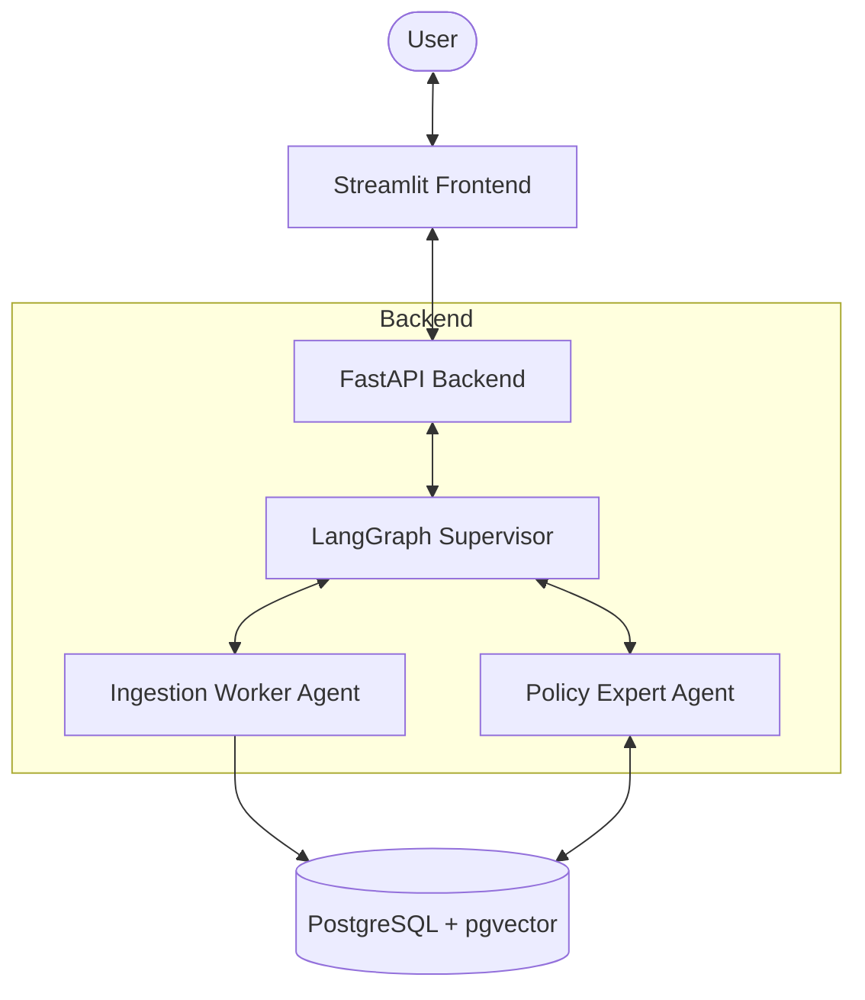

# System Architecture

The Enterprise Policy Agent is a modern AI-driven application designed to ingest corporate policy documents, index them for retrieval, and answer user questions accurately. The system is split into three main tiers: a frontend, a backend, and a database layer.

## High-Level Diagram

## Core Components

1. **Frontend (Streamlit):**
   Provides a clean and intuitive user interface. Users can chat with the agent and upload PDF documents to the system.
   
2. **Backend API (FastAPI):**
   Serves as the bridge between the frontend and the AI logic. It exposes REST endpoints for chatting, session management, and document uploads. It also manages structured logging for each chat session.

3. **Agent Orchestration (LangGraph):**
   The heart of the system. A state graph manages the conversation flow using a Supervisor pattern. Depending on the user's input, the Supervisor routes the task to either the **Policy Expert** (to answer questions using RAG) or the **Ingestion Worker** (to process newly uploaded PDFs).

4. **Database (PostgreSQL + pgvector):**
   Stores raw document metadata and generates vector embeddings of the text chunks. This allows the Policy Expert agent to perform semantic searches and retrieve relevant policy sections when answering user queries.

## Technology Stack
- **Frontend:** Streamlit, Python, requests
- **Backend:** FastAPI, Uvicorn, Pydantic, Loguru
- **AI/Agents:** LangChain, LangGraph, Google Generative AI
- **Database:** PostgreSQL, pgvector, psycopg
